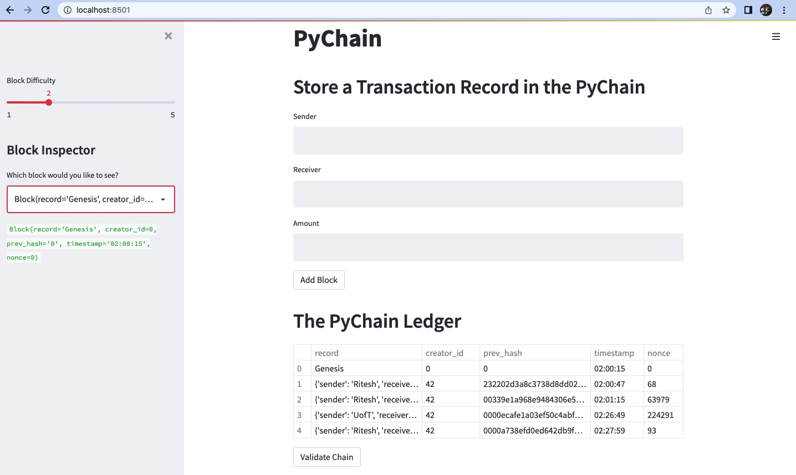

# PyChain Ledger

You’re a fintech engineer who’s working at one of the five largest banks in the world. You were recently promoted to act as the lead developer on their decentralized finance team. Your task is to build a blockchain-based ledger system, complete with a user-friendly web interface. This ledger should allow partner banks to conduct financial transactions (that is, to transfer money between senders and receivers) and to verify the integrity of the data in the ledger.

---
## Running and Testing the PyChain Ledger

Test the complete `PyChain` ledger and user interface by running the Streamlit application and storing some mined blocks in the `PyChain` ledger. Then test the blockchain validation process by using your `PyChain` ledger. To do so, complete the following steps:

1. In the terminal, navigate to the folder where you've saved pychain.py

2. In the terminal, run the Streamlit application by using `streamlit run pychain.py`.

3. Enter values for the sender, receiver, and amount, and then click the Add Block button. Do this several times to store several blocks in the ledger.

4. Verify the block contents and hashes in the Streamlit dropdown menu. 

5. Test the blockchain validation process by using the web interface (click on "Validate Claim") 

---
## Streamlit Application Demo

 Below screenshot of the Streamlit application page, shows a blockchain that consists of multiple blocks and shows the validilty of the blockchain. 
 

* Video of the Streamlit Application is saved as pychain_video.mov

---

